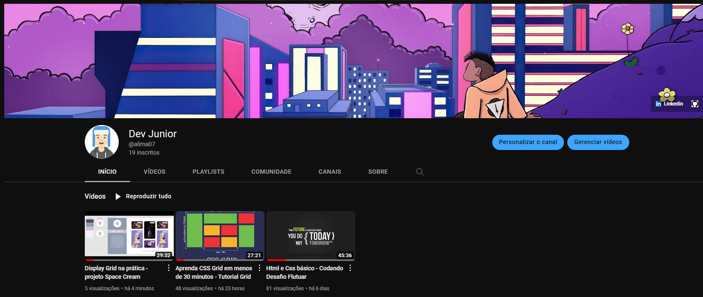

<h1 align="center"> Revisão Display Grid - Projeto Space Cream 💜 </h1>

Código desenvolvido com o objetivo de criar um VÍDEO para o canal DEV JUNIOR no youtube e para que os alunos da turma 9 do curso, possam fazer uma análise comparativa do projeto codado, com o projeto codado por deles.

  

Você pode acessar o VÍDEO através do link: 
<a href= "https://www.youtube.com/watch?v=bp9m3AzWmx0" target="_blank"> Clique aqui ⏯ </a>

Você pode acessar a PÁGINA do projeto através do link: 
<a href= "https://alima07.github.io/rocketseat-stage3-revisao-video-space-cream/" target="_blank"> Clique aqui 🤖 </a>

